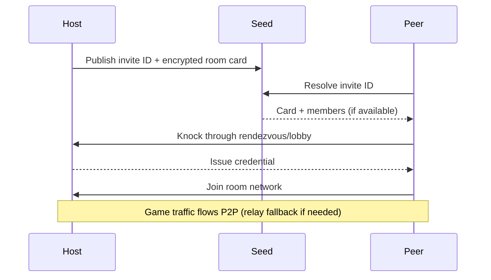
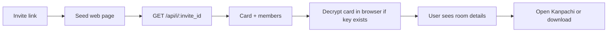

<p align="center">
  <picture>
    <source media="(prefers-color-scheme: dark)" srcset="logos/kanpachi_white.svg">
    <source media="(prefers-color-scheme: light)" srcset="logos/kanpachi_black.svg">
    
  </picture>
</p>

<p align="center">
  <strong>Kanpachi</strong> is a private virtual LAN for playing games with friends.
  <br>
  It builds an encrypted peer-to-peer network and keeps everything the game did not ask for closed on the virtual adapter.
</p>

## What Is Kanpachi?

Kanpachi is a gaming utility for friend groups that want a simpler and safer LAN-over-internet setup.

- Create a room and share an invite code.
- Join through an encrypted peer-to-peer tunnel.
- Open only the game ports needed for the active session.
- Keep protection active by default while the room is running.

If the room directory service is unavailable, the room can still work. What degrades is the invite card presentation.

See the protection statement: [kanpachi-protection.md](kanpachi-protection.md).

## Screenshots

<p align="center">
  
  
  
</p>

<p align="center">
  
  
</p>

## Repositories

| Repository | Purpose |
|---|---|
| [kanpachi](https://github.com/alvarogabrielgomez/kanpachi) | Main daemon, UI, docs, scripts, and installer wiring |
| [kanpachi-engine](https://github.com/alvarogabrielgomez/kanpachi-engine) | Rust network engine binary used by the daemon |
| [EasyTier fork](https://github.com/alvarogabrielgomez/EasyTier) | Upstream-based dependency with Kanpachi-specific firewall change |

## How Host, Peers and Seed Connect

Short version:

- The seed is a public meeting point, not the game tunnel itself.
- The host publishes an invite ID and an encrypted room card in the seed registry.
- Peers use that invite to find the host and request access.
- The host decides who enters by issuing credentials.
- Data traffic then goes peer-to-peer (or relay fallback), while the seed stays as coordination.



## Host Your Own Seed (Linux)

To install and host your own Kanpachi seed on a Linux server with systemd:

```sh
curl -fsSL https://raw.githubusercontent.com/alvarogabrielgomez/kanpachi/main/seed/install.sh | sudo sh
```

With explicit domain during setup:

```sh
curl -fsSL https://raw.githubusercontent.com/alvarogabrielgomez/kanpachi/main/seed/install.sh | sudo sh -s -- --domain seed.yourdomain.com
```

After installation:

- Check health and services:

  ```sh
  sudo kanpseed doctor
  ```

- Print the reverse-proxy block to paste in nginx:

  ```sh
  kanpseed nginx
  ```

### What The Seed Web Page Is For

The invite page is a lightweight entry point for users opening a room link.

- It reads the invite ID from the URL path.
- It asks the same seed for room metadata at /api/i/{invite_id}.
- If the URL fragment includes the card key, the browser decrypts and shows room/host text.
- It offers the direct action: open Kanpachi (or download if not installed).
- If the registry API is down, the page still works with a generic card so users can still continue.



## Quick Technical Notes

This section is intentionally short and points to auditable sources.

- What changed in each release: [CHANGELOG.md](CHANGELOG.md)
- Security promise and scope: [kanpachi-protection.md](kanpachi-protection.md)
- Architecture and process boundaries: [docs/03-arquitectura.md](docs/03-arquitectura.md)
- Engine behavior and non-listening model: [kanpachi-engine README](https://github.com/alvarogabrielgomez/kanpachi-engine)
- EasyTier fork rationale and minimal diff record: [EasyTier/FORK.md](https://github.com/alvarogabrielgomez/EasyTier/blob/kanpachi/FORK.md)
- Evidence scripts used during verification:
  - [scripts/medir-motor-punta-a-punta.ps1](scripts/medir-motor-punta-a-punta.ps1)
  - [scripts/medir-directorio.ps1](scripts/medir-directorio.ps1)
  - [scripts/medir-reset.ps1](scripts/medir-reset.ps1)

There is no private source code in this project: all code and documentation are public.

---

<p align="center"><sub>Made by Alvaro Gomez · Accentio Studios</sub></p>
<p align="center"><sub><a href="https://accentiostudios.com">accentiostudios.com</a></sub></p>
