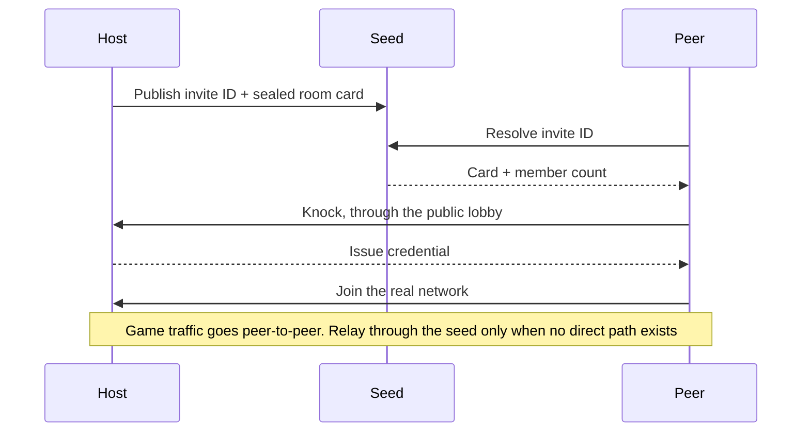

<p align="center">
  <picture>
    <source media="(prefers-color-scheme: dark)" srcset="logos/kanpachi_white.svg">
    <source media="(prefers-color-scheme: light)" srcset="logos/kanpachi_black.svg">
    
  </picture>
</p>

<p align="center">
  <strong>Kanpachi</strong> is a private virtual LAN for playing games with friends.
  <br>
  It builds an encrypted peer-to-peer network and keeps everything the game did not ask for closed on the virtual adapter.
</p>

## What Is Kanpachi

A LAN party over the internet. One person opens a room and hands out an invite
code, everybody else pastes it, and the machines end up on one private network
with an encrypted peer-to-peer tunnel between them. What a general-purpose
virtual LAN does not do is the next part: the adapter is born closed, and the
only thing that opens on it is what the chosen game asks for, on the host
machine, toward the people in the room right now.

No account, nothing to pay, nobody in the middle. A machine is identified by a
key it never sends anywhere and a room by a code pasted into a chat, so there is
no user record to breach or sell, and no code anywhere counts heads. The meeting
server is a one-line install on any Linux box and steps out of the path once the
tunnel is up. All of it is free software under AGPL-3.0, documents included.

## Quick Start

### Windows

Download `kanpachi-setup.exe` from the
[releases page](https://github.com/alvarogabrielgomez/kanpachi/releases/latest)
and run it, or open an invite link and let the page hand you the right file.
There is one UAC prompt for the whole install, and it is the only one in the
life of the product: everything that needs elevation happens there.

The installer registers `kanpachi-daemon`, a Windows service running as
`LocalSystem` with delayed automatic start, which is what holds the room and
writes the firewall rules. The window you use is a separate program that talks
to it, so closing the window keeps the room open and keeps the ports as they
were. Playing never asks for administrator again. Step by step, with the
portable build and the uninstall:
[install on Windows](docs/public/install-windows.md).

### Linux

Ubuntu 22.04 or newer, amd64, one line:

```sh
curl -fsSL -o /tmp/kanpachi.deb https://github.com/alvarogabrielgomez/kanpachi/releases/latest/download/kanpachi-amd64.deb && sudo apt install -y /tmp/kanpachi.deb
```

That is the whole install. `kanpachid.service` starts and is enabled at boot,
and so is `kanpachi-quarantine.service`, which keeps file sharing, remote
desktop and remote management closed from the internet **even while Kanpachi is
stopped**. There is no window here: the client is `kanpachi`, and typing it with
no arguments opens an assistant that walks through hosting or joining. Why
`apt install /path` and not `dpkg -i`, what lands where, how to check the two
services and how to remove them: [install on Linux](docs/public/install-linux.md).

### Your Own Seed

A seed is the meeting point that introduces two machines to each other. Ours is
not required, and running one is a single line on any Linux box with systemd:

```sh
curl -fsSL https://raw.githubusercontent.com/alvarogabrielgomez/kanpachi/main/seed/install.sh | sudo sh -s -- --domain seed.yourdomain.com
```

The domain is not decoration. It is what travels inside every invite code minted
here — `A7K2-M9QX@seed.yourdomain.com` — so the code says which registry it
means, and it is what the hosting password is bound to. Point an A record at the
machine before installing. The installer picks free ports, places the engine,
writes two systemd units and leaves the registry answering on loopback.

Publishing it to the internet is the part it deliberately does not do for you.
`kanpseed nginx` prints the reverse-proxy block to paste into nginx or Nginx
Proxy Manager, with TLS, because the invitation page uses `navigator.clipboard`
and that API only exists in a secure context. The engine's port, `11010` by
default, has to be open TCP **and** UDP; `kanpseed doctor` says so if ufw is in
the way. Opening a port to the whole world is the machine owner's call, not an
installer's.

Hosting on a seed can ask for a password, which is what stops strangers parking
their rooms on your bandwidth. `sudo kanpseed init` offers it at the end, and
`sudo kanpseed password` sets or removes it later. There is one shared password
and no accounts, it is typed at a terminal and never as a flag, and **joining a
room never asks for it on any seed**. Full walkthrough:
[host your own seed](docs/public/host-a-seed.md).

## Screenshots

<p align="center">
  
  
  
</p>

<p align="center">
  
  
</p>

## Technical Summary

Three parts, and the important thing is which one is on the path of your game
traffic. The **daemon** holds the room and is the only thing that writes
firewall rules. The **engine** moves packets and decides nothing, listening on
no port at all. The **seed** mints invite codes and introduces peers, and once
the tunnel is up it is no longer in the middle.



The code is a lookup key, never a key that opens anything: what admits somebody
is a credential the host issues over the control channel, and the room card the
seed stores is sealed with a key that travels in the URL fragment, the part
browsers never send to a server. When no direct path can be built — symmetric
NAT, usually — packets fall back to travelling through the seed, still encrypted
end to end with a key that machine was never given, and the app says the room is
degraded instead of hiding it.

## Where To Read Next

The public documentation is split by what you are doing when you open it:
learning, getting something done, looking something up, understanding how it
works. The index is [docs/public/](docs/public/README.md), and these are the
entry points.

| What you want | Where it is |
|---|---|
| **Start here** | [Your first room](docs/public/tutorial-first-room.md), from installing to playing with a friend |
| **How to** | [Windows](docs/public/install-windows.md) · [Linux](docs/public/install-linux.md) · [Host a seed](docs/public/host-a-seed.md) · [Run a 24/7 game server](docs/public/run-a-game-server.md) · [Build and test from source](docs/public/build-from-source.md) · [Fork it](docs/public/fork-the-branding.md) |
| **Reference** | [Every command](docs/public/reference-cli.md) · [What gets installed, and where](docs/public/reference-files.md) · [The seed's HTTP API](registry/API.md) · [What changed in each release](CHANGELOG.md) |
| **Understand** | [Kanpachi Protection](kanpachi-protection.md), the promise and its limits · [The seed](kanpachi-seed.md), what it sees and stores · [Architecture](docs/public/architecture.md), the three repositories and why they are three |

Two of those live in other repositories, because that is where the code they
describe lives: the [engine](https://github.com/alvarogabrielgomez/kanpachi-engine)
explains why it listens on nothing, and the
[EasyTier fork](https://github.com/alvarogabrielgomez/EasyTier/blob/kanpachi/FORK.md)
records what it changes against upstream and why the change had to be a fork.

Kanpachi's design documents — every decision with its alternatives and its
reason — are in Spanish and live in [`docs/`](docs/). There is no private source
code in this project: all code and documentation are public.

## License

Kanpachi is free software: **[AGPL-3.0-or-later](LICENSE)**, with the game
catalogue in **CC0-1.0**. AGPL and not GPL because one part of Kanpachi is a
network service — anyone can run a meeting server, and §13 is what obliges a
*modified* one to hand its source to the people using it.

The full map of what is under which licence is in [LICENSES.md](LICENSES.md),
and what ships alongside Kanpachi without being ours — the network engine under
LGPL-3.0, and three Windows libraries — is in
[THIRD-PARTY-NOTICES.md](THIRD-PARTY-NOTICES.md), with links to their
corresponding source.

---

<p align="center"><sub>Made by Alvaro Gomez · Accentio Studios</sub></p>
<p align="center"><sub><a href="https://accentiostudios.com">accentiostudios.com</a></sub></p>
