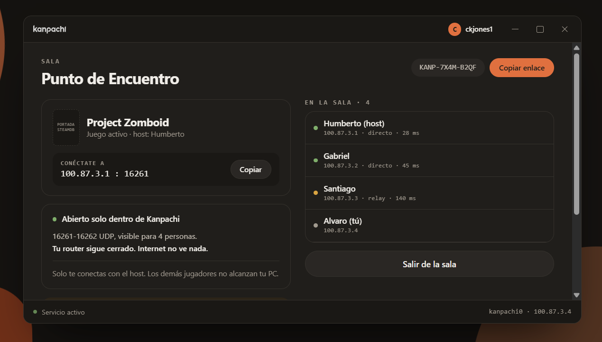
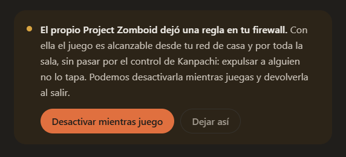
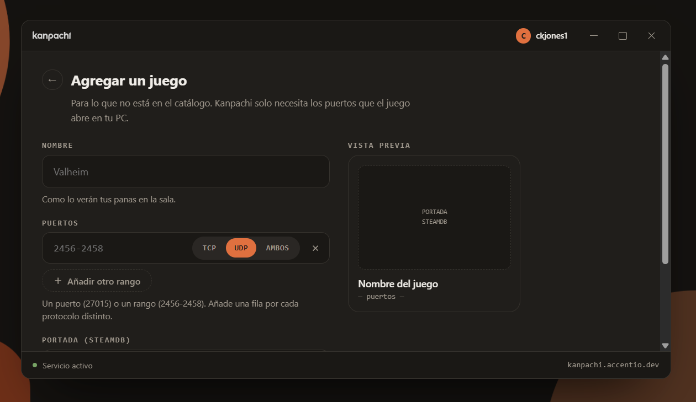
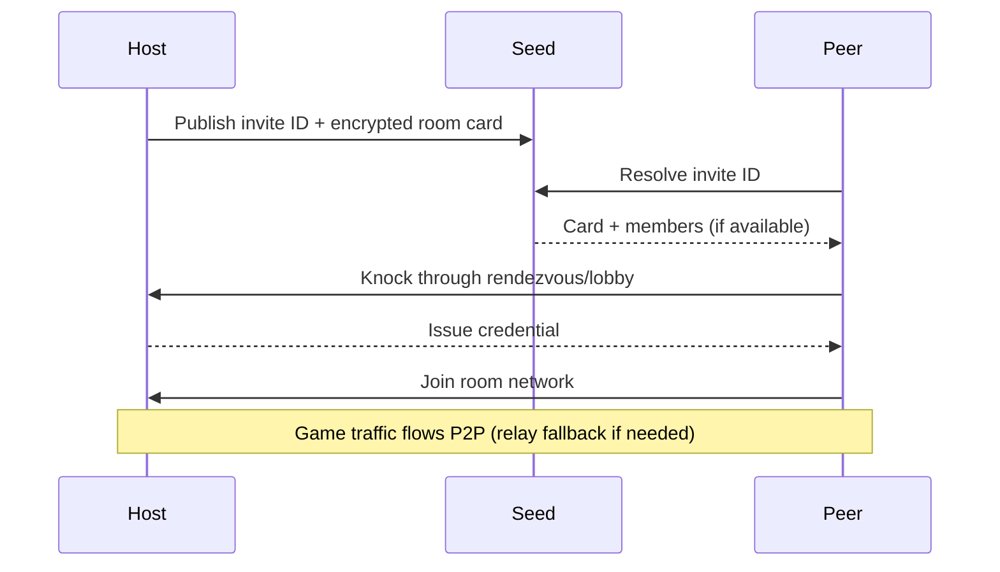
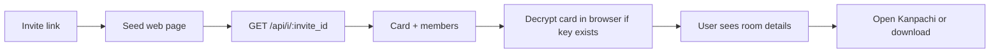

<p align="center">
  <picture>
    <source media="(prefers-color-scheme: dark)" srcset="logos/kanpachi_white.svg">
    <source media="(prefers-color-scheme: light)" srcset="logos/kanpachi_black.svg">
    
  </picture>
</p>

<p align="center">
  <strong>Kanpachi</strong> is a private virtual LAN for playing games with friends.
  <br>
  It builds an encrypted peer-to-peer network and keeps everything the game did not ask for closed on the virtual adapter.
</p>

## What Is Kanpachi?

Kanpachi is a gaming utility for friend groups that want a simpler and safer LAN-over-internet setup.

- Create a room and share an invite code.
- Join through an encrypted peer-to-peer tunnel.
- Open only the game ports needed for the active session.
- Keep protection active by default while the room is running.

It runs on **Windows**, with a window, and on **Linux**, headless, for the case a
window cannot cover: a Minecraft or Project Zomboid server on a VPS, where the
usual answer is to open a port to the whole internet. A room stays open as long
as the host wants, so the same invite code still works next week.

Windows and Linux are the same room. The invite code, the key derivation, the
credential exchange and the tunnel are identical on both.

If the room directory service is unavailable, the room can still work. What degrades is the invite card presentation.

See the protection statement: [kanpachi-protection.md](kanpachi-protection.md), and what the
meeting server does, sees and stores: [kanpachi-seed.md](kanpachi-seed.md).

## No Account, No Bill, Nobody In The Middle

Four things Kanpachi does not have. Each one is a decision, and each one is the
reason for something else in this README.

- **No account.** There is nothing to sign up for, no email, no password to
  recover. What identifies a machine is a key it generates itself and never
  sends anywhere, and what identifies a room is a code somebody pastes into a
  chat. Nothing was ever collected, so nothing can be handed over, breached or
  sold later.
- **No paid tier, and nobody counting heads.** A room addresses a `/24`, which
  is 253 places, and no code anywhere asks who is paying for them. On other
  virtual-LAN services the number of people in your room is a price, and hosting
  while nobody is sitting at the machine is the feature behind the subscription.
  Here they are just how the thing works.
- **No server you are required to use.** The meeting server is a one-line
  install on any Linux box, and the seed's name travels **inside** the invite
  code — `A7K2-M9QX@seed.example.com` — so the code says which registry it means
  and two seeds are two unrelated worlds. Run your own and nothing of ours is on
  the path. A seed can ask for a password to host on it, which is what stops
  strangers parking their rooms on your bandwidth; joining a room never asks for
  it, on any seed.
- **Nothing hidden, and nothing you have to take on trust.** Kanpachi is free
  software under the **AGPL-3.0**. Every line of the client, the daemon, the
  engine and the meeting server is public and builds from source, and so is
  every document that explains why it is built that way — including the parts
  that say what Kanpachi cannot do and where a hostile meeting server would
  still win. The licence is the part that keeps the third bullet true: anyone
  running a **modified** meeting server for other people owes them its source.

The one to be precise about is the third. Peer-to-peer is not a slogan here: the
tunnel is direct between the two routers whenever the routers allow it, and the
seed is only a meeting point that steps out of the way. When a direct path
cannot be built, packets fall back to travelling through the seed, still
encrypted end to end with a key that machine was never given, and the app says
the room is degraded rather than hiding it.

## Hosting 24/7, With Nobody At The Keyboard

The Linux daemon is built for the machine that is always on: a game server on a
VPS, running as a systemd service, with no window and nobody logged in.

It reopens its own room at startup. Not a prompt, not a script somebody has to
remember — when the daemon comes up and finds a room that was never closed, it
brings it back with **the same invite code, the same network identity, the same
subnet and the same game profile**, and republishes the room card so the
invitation page keeps showing the real room instead of a generic one
([`daemon/service/arranque.go`](daemon/service/arranque.go),
[`core/usecase/resumeroom.go`](core/usecase/resumeroom.go)).

That covers a reboot, a power cut, and an `apt upgrade` that restarts the
service. Shutting down and closing the room are two different events on purpose:
only somebody pressing "close the room" deletes the file, so reopening can never
resurrect a room you meant to end. The invite code you pasted into the group
chat in March still works in June, without anybody touching the server in
between.

Worth being precise about what this does not change: the reopened room comes
back with **no ports open**. Rules are recalculated from who is actually
present, and with nobody there the desired set is empty. The game profile is
restored, the ports it asks for are not opened until there is somebody to open
them towards.

## Screenshots

<p align="center">
  
  
  
</p>

<p align="center">
  
  
</p>

## Install

### Windows

Download the installer from the [releases page](https://github.com/alvarogabrielgomez/kanpachi/releases/latest), or open an invite link and let the page hand you the right file.

### Linux · Ubuntu 22.04 or newer, amd64

One line:

```sh
curl -fsSL -o /tmp/kanpachi.deb https://github.com/alvarogabrielgomez/kanpachi/releases/latest/download/kanpachi-amd64.deb && sudo apt install -y /tmp/kanpachi.deb
```

That is the whole install. The service starts and is enabled at boot, and so is
the quarantine that keeps your game ports closed from the internet.

#### Building the package yourself

Everything here is public, so the package is reproducible from source:

```sh
# in the engine repository
scripts/build-linux.sh
# in this one
scripts/build-deb.sh --version 0.2.0 --engine ~/.cache/kanpachi-engine-target/release/kanpachi-engine
```

Both run **on** Linux. There is no cross-compile in either direction, and that
is not an omission: on Linux the engine pulls in a vendored `dbus`, `zstd-sys`
and `kcp-sys` through bindgen, which is three C toolchains that would need a
Linux linker and sysroot mounted by hand elsewhere. The scripts name what is
missing instead of letting the compiler guess.

#### Why not `apt install kanpachi`

Because Kanpachi is not in Ubuntu's repositories, and with a plain `.deb` it will
not be. The path is what makes the difference, and getting it wrong is the one
mistake worth naming:

```sh
apt install kanpachi-amd64.deb     # E: Unable to locate package — apt searched the repos
apt install /tmp/kanpachi.deb      # installs it — apt saw a path, not a name
```

`apt` and not `dpkg -i`, because `dpkg` stops when a dependency is missing and
leaves the package half configured. `apt` pulls `nftables`, `libc6` and
`systemd` from the official repositories first.

There is no APT repository of ours to add, and that is a deliberate choice: an
APT signing key is the key that pushes code **as root** to every machine that
trusts it, and holding one is a permanent responsibility rather than an
afternoon of work.

#### What it installs

| Path | What |
|---|---|
| `/usr/bin/kanpachi` | the command line client |
| `/usr/libexec/kanpachi/kanpachid` | the daemon |
| `/usr/libexec/kanpachi/kanpachi-engine` | the network engine |
| `/usr/share/kanpachi/builtin.json` | the game catalogue that ships with the package |
| `/etc/kanpachi/quarantine.nft` | the base quarantine, written by the daemon |
| `/var/lib/kanpachi/` | state: identity key, API token, the room |
| `/run/kanpachi/api.sock` | the control socket, `0600`, in a `0700` root-owned directory |

And two systemd units:

- `kanpachid.service` — the daemon. `Type=notify`, so `systemctl start` does not
  return until the control socket is listening.
- `kanpachi-quarantine.service` — **the one that matters when Kanpachi is off.**
  It loads before the network comes up and keeps the game ports closed from the
  internet with nothing of ours running. Stopping it does not lift the
  quarantine; only uninstalling does.

Check both with:

```sh
systemctl status kanpachid kanpachi-quarantine
sudo nft list table inet kanpachi-base   # the quarantine, as the kernel sees it
```

#### Verifying the download

Every release publishes `SHA256SUMS-linux`:

```sh
curl -fsSL -O https://github.com/alvarogabrielgomez/kanpachi/releases/latest/download/SHA256SUMS-linux
sha256sum -c SHA256SUMS-linux --ignore-missing
```

Worth being precise about what this buys: it catches a truncated or tampered
**download**, not a bad release, since the sums file lives in the same release as
the package. What protects the release itself is that everything here is public
and reproducible from source.

#### Uninstalling

```sh
sudo apt remove kanpachi    # removes the program and the quarantine, keeps your identity
sudo apt purge kanpachi     # also deletes /var/lib/kanpachi and /etc/kanpachi
```

The difference is the identity key. `remove` keeps it, so reinstalling leaves
this machine as the same machine for everyone who already played with it;
`purge` deletes it. Either way the quarantine goes: a firewall rule that outlives
the program that put it there is the hardest kind of problem to diagnose.

## Repositories

| Repository | Purpose |
|---|---|
| [kanpachi](https://github.com/alvarogabrielgomez/kanpachi) | Main daemon, UI, docs, scripts, and installer wiring |
| [kanpachi-engine](https://github.com/alvarogabrielgomez/kanpachi-engine) | Rust network engine binary used by the daemon |
| [EasyTier fork](https://github.com/alvarogabrielgomez/EasyTier) | Upstream-based dependency with Kanpachi-specific firewall change |

## How Host, Peers and Seed Connect

Short version:

- The seed is a public meeting point, not the game tunnel itself.
- The host publishes an invite ID and an encrypted room card in the seed registry.
- Peers use that invite to find the host and request access.
- The host decides who enters by issuing credentials.
- Data traffic then goes peer-to-peer (or relay fallback), while the seed stays as coordination.



## Host Your Own Seed (Linux)

To install and host your own Kanpachi seed on a Linux server with systemd:

```sh
curl -fsSL https://raw.githubusercontent.com/alvarogabrielgomez/kanpachi/main/seed/install.sh | sudo sh
```

With explicit domain during setup:

```sh
curl -fsSL https://raw.githubusercontent.com/alvarogabrielgomez/kanpachi/main/seed/install.sh | sudo sh -s -- --domain seed.yourdomain.com
```

After installation:

- Check health and services:

  ```sh
  sudo kanpseed doctor
  ```

- Print the reverse-proxy block to paste in nginx:

  ```sh
  kanpseed nginx
  ```

The seed's whole HTTP surface — every endpoint, the optional hosting password,
and what defends each thing — is documented in
[registry/API.md](registry/API.md).

### What The Seed Web Page Is For

The invite page is a lightweight entry point for users opening a room link.

- It reads the invite ID from the URL path.
- It asks the same seed for room metadata at /api/i/{invite_id}.
- If the URL fragment includes the card key, the browser decrypts and shows room/host text.
- It offers the direct action: open Kanpachi (or download if not installed).
- If the registry API is down, the page still works with a generic card so users can still continue.



## Forking: Where The Branding Lives

Everything that says *who published this binary* is in one file per language,
and a fork edits those and nothing else.

| Language | File | What it holds |
|---|---|---|
| Go | `internal/brand/brand.go` | `Repo`, `UpdatesEnabled`, `Docs` |
| Dart | `ui/lib/core/brand.dart` | The same two values, mirrored |

Nothing else in the tree may spell the repository out. The page receives it from
the server in its SSR state, the systemd units import the Go constant, the Inno
Setup installer takes it as a `/DRepo=` parameter, and `seed/install.sh` is the
one exception, because it is fetched over a URL that already contains the
repository. `internal/arch/marca_test.go` fails the build if a copy reappears
anywhere, and a second test keeps the Go and Dart values in lockstep.

The Rust engine has no branding file. It carries no such constant in its source:
its only two URLs are in `Cargo.toml`, where `repository` is the canonical Rust
place for it and points at a different repository anyway.

`UpdatesEnabled = false` turns the version check off entirely, in both faces.
That switch exists because the alternative — pointing `Repo` at a repository
that does not publish — does not disable the check, it turns it into a 404 every
time somebody asks.

**What must never move into these files:** anything the two machines in a room
compute independently. The Argon2id parameters, the invite ID alphabet, and the
pinned EasyTier version look like configuration and are not. They are frozen,
with golden vectors in the tests, because both sides derive them separately and
without talking; a fork that "configures" them produces rooms where people paste
the same code and end up alone, with nothing on screen pointing at the cause.

## Quick Technical Notes

This section is intentionally short and points to auditable sources.

- What changed in each release: [CHANGELOG.md](CHANGELOG.md)
- Security promise and scope: [kanpachi-protection.md](kanpachi-protection.md)
- What the meeting server does, sees and stores: [kanpachi-seed.md](kanpachi-seed.md)
- The seed's HTTP API, endpoint by endpoint: [registry/API.md](registry/API.md)
- Architecture and process boundaries: [docs/03-arquitectura.md](docs/03-arquitectura.md)
- Engine behavior and non-listening model: [kanpachi-engine README](https://github.com/alvarogabrielgomez/kanpachi-engine)
- EasyTier fork rationale and minimal diff record: [EasyTier/FORK.md](https://github.com/alvarogabrielgomez/EasyTier/blob/kanpachi/FORK.md)
- Evidence scripts used during verification:
  - [scripts/measure-engine-end-to-end.ps1](scripts/measure-engine-end-to-end.ps1)
  - [scripts/measure-directory.ps1](scripts/measure-directory.ps1)
  - [scripts/measure-reset.ps1](scripts/measure-reset.ps1)

There is no private source code in this project: all code and documentation are public.

## License

Kanpachi is free software: **[AGPL-3.0-or-later](LICENSE)**, with the game
catalogue in **CC0-1.0**. AGPL and not GPL because one part of Kanpachi is a
network service — anyone can run a meeting server, and §13 is what obliges a
*modified* one to hand its source to the people using it.

The full map of what is under which licence is in [LICENSES.md](LICENSES.md),
and what ships alongside Kanpachi without being ours — the network engine under
LGPL-3.0, and three Windows libraries — is in
[THIRD-PARTY-NOTICES.md](THIRD-PARTY-NOTICES.md), with the links to their
corresponding source.

---

<p align="center"><sub>Made by Alvaro Gomez · Accentio Studios</sub></p>
<p align="center"><sub><a href="https://accentiostudios.com">accentiostudios.com</a></sub></p>
